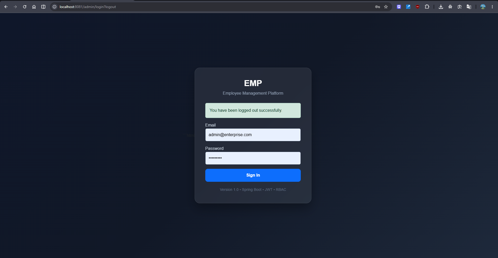
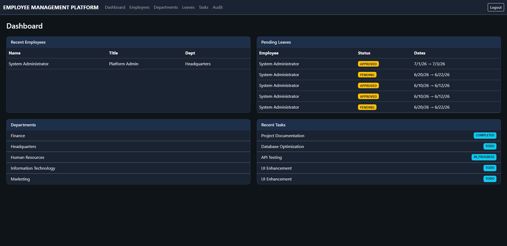
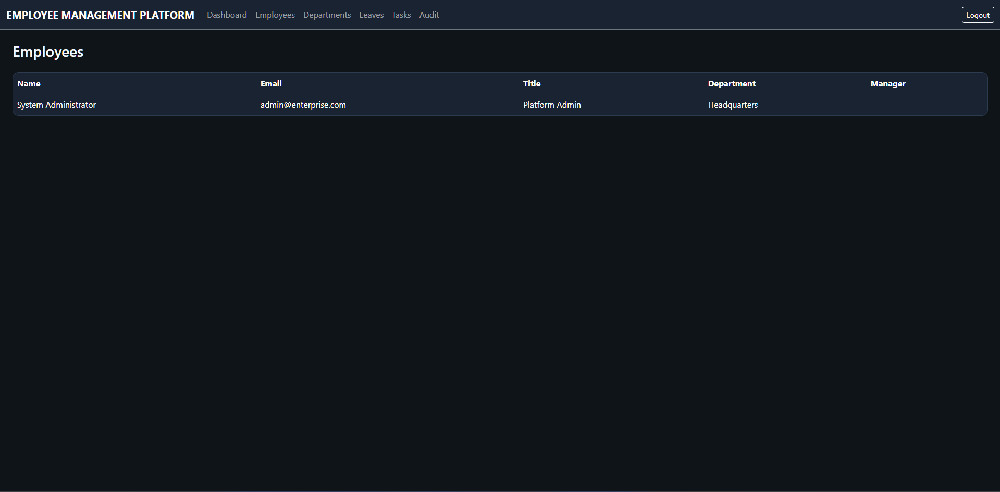
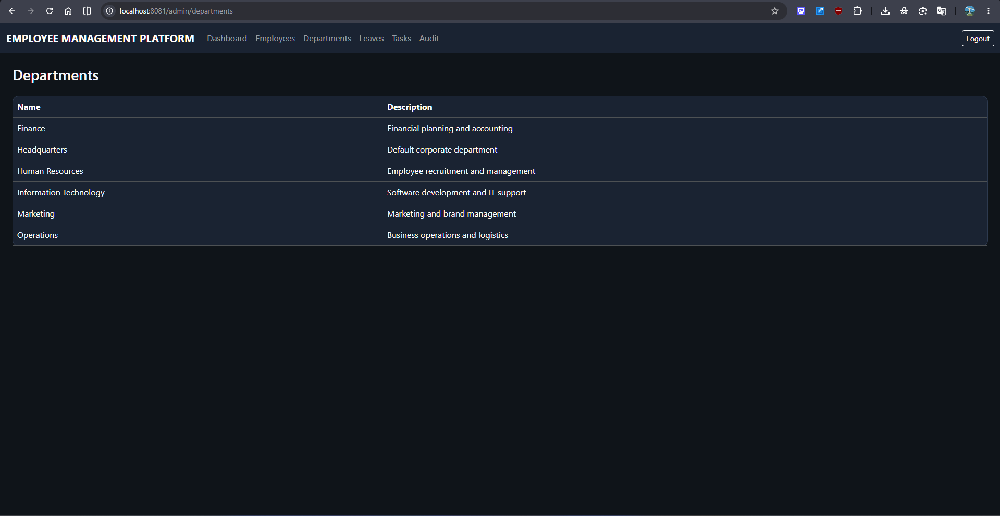
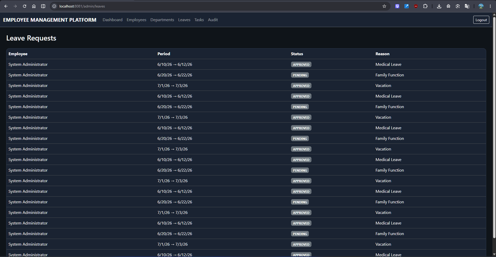
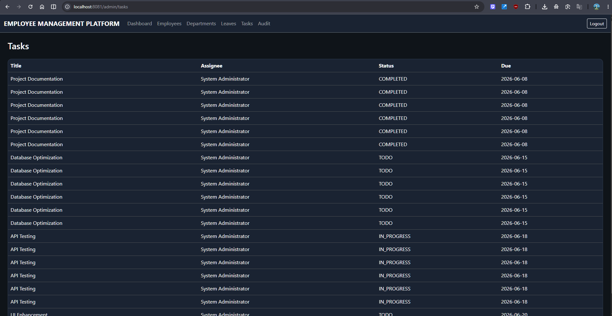
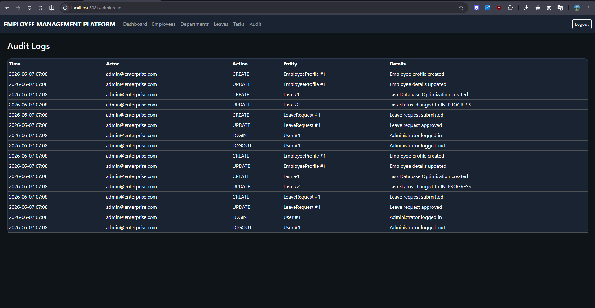
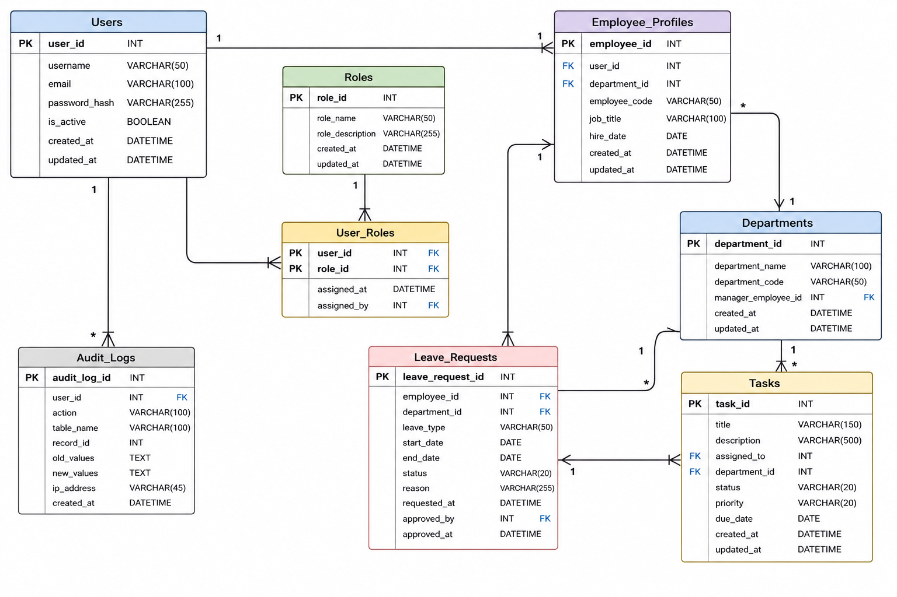
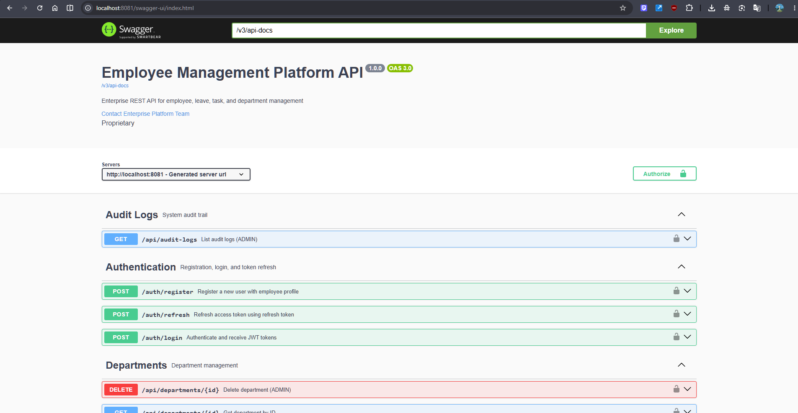

# Enterprise Employee Management Platform


A modern Enterprise Employee Management Platform built using Spring Boot, Spring Security, JWT Authentication, Thymeleaf, MySQL, Flyway, and Role-Based Access Control (RBAC).

---

# Overview

The Enterprise Employee Management Platform is a secure full-stack web application designed to manage employees, departments, leave requests, tasks, and audit logs within an organization.

The platform follows enterprise-grade architecture and security practices using Spring Boot 3, Spring Security, JWT Authentication, MySQL, and Flyway database migrations.

---

# Features

## Authentication & Security

* Spring Security 6
* JWT Authentication
* Role-Based Access Control (RBAC)
* BCrypt Password Encryption
* Secure Session Management

## Employee Management

* Employee Profile Management
* Employee Directory
* Manager Assignment
* Department Assignment

## Department Management

* Department Creation
* Department Listing
* Department Organization

## Leave Management

* Leave Requests
* Leave Approval Workflow
* Leave Status Tracking

## Task Management

* Task Assignment
* Task Tracking
* Due Date Monitoring
* Status Management

## Audit Logging

* User Activity Tracking
* CRUD Audit Trail
* System Monitoring
* Security Auditing

---

# Technology Stack

| Layer          | Technology        |
| -------------- | ----------------- |
| Language       | Java 21           |
| Backend        | Spring Boot 3.5   |
| Security       | Spring Security 6 |
| Authentication | JWT               |
| Frontend       | Thymeleaf         |
| Styling        | Bootstrap 5       |
| Database       | MySQL             |
| ORM            | Hibernate / JPA   |
| Migration      | Flyway            |
| Build Tool     | Maven             |
| Documentation  | Swagger OpenAPI   |

---

# Screenshots

## Login Page



## Dashboard



## Employees



## Departments



## Leave Management



## Task Management



## Audit Logs



---

# System Architecture


---

# Database ER Diagram



---

# API Documentation



---

# Project Structure

```text
src
├── main
│   ├── java
│   │   └── com.enterprise.empmgmt
│   │       ├── config
│   │       ├── controller
│   │       ├── service
│   │       ├── repository
│   │       ├── security
│   │       ├── mapper
│   │       ├── domain
│   │       ├── dto
│   │       └── exception
│   │
│   └── resources
│       ├── templates
│       ├── static
│       ├── db
│       │   └── migration
│       └── application.yml
│
└── test
```

---

# Database Design

The platform is built around the following entities:

* Users
* Roles
* User Roles
* Employee Profiles
* Departments
* Leave Requests
* Tasks
* Audit Logs

The database schema is managed using Flyway migrations and Hibernate ORM.

---

# Security Features

* JWT Token Authentication
* Spring Security Filter Chains
* Password Encryption with BCrypt
* Role-Based Access Control
* Secure REST APIs
* Protected Administrative Endpoints

---

# Modules

### Dashboard

* Employee Overview
* Department Overview
* Leave Statistics
* Task Monitoring

### Employees

* Employee Records
* Profile Management

### Departments

* Department Administration

### Leaves

* Leave Request Processing

### Tasks

* Task Assignment & Tracking

### Audit

* Activity Monitoring
* Security Logs

---

# Getting Started

## Clone Repository

```bash
git clone https://github.com/GEEKKARAN6713/Enterprise-Employee-Management-Platform.git
```

## Navigate to Project

```bash
cd Enterprise-Employee-Management-Platform
```

## Create Database

```sql
CREATE DATABASE emp_mgmt;
```

## Configure Database

Update database credentials inside:

```text
src/main/resources/application.yml
```

## Run Application

```bash
mvn spring-boot:run
```

Application URL:

```text
http://localhost:8081
```

Admin Portal:

```text
http://localhost:8081/admin/login
```

---

# API Documentation

Swagger UI:

```text
http://localhost:8081/swagger-ui/index.html
```

---

# Future Enhancements

* Attendance Management
* Payroll Management
* Email Notifications
* Performance Reviews
* Employee Self-Service Portal
* Analytics Dashboard
* AI-Powered HR Insights
* Cloud Deployment

---

# Resume Project Description

Developed a full-stack Enterprise Employee Management Platform using Java 21, Spring Boot 3, Spring Security, JWT Authentication, Thymeleaf, MySQL, Flyway, and Role-Based Access Control (RBAC). Implemented employee lifecycle management, department administration, leave processing, task tracking, audit logging, secure REST APIs, and responsive administrative dashboards following enterprise-grade architecture and security practices.

---

# Author

**Karan**
B.Tech Information Technology 
2026 Graduate

---

© 2026 Enterprise Employee Management Platform
